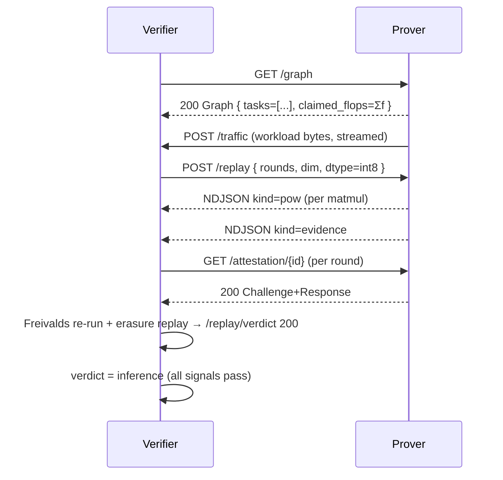
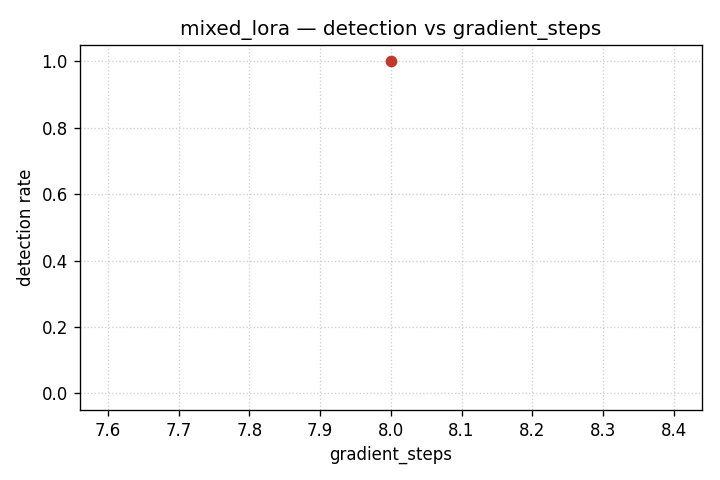
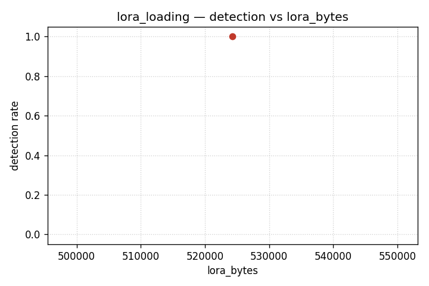

# Prover-Verifier Demo — Memo

## Problem

A serving operator (the **prover**) runs models on hardware they control;
their customer (the **verifier**) wants on-the-fly evidence that the prover
is doing the inference workload they paid for and *only* that workload —
not training a side model on prompts, not exfiltrating data, not loading
unauthorized adapters. We want a wire-protocol-level demo that detects
each of those cheating modes from external evidence alone.

## Architecture

Two stdlib HTTP servers exchange a fixed protocol:

- `GET /graph` — the prover's claim about what it is doing (placeholder
  here; the production version threads the real task graph).
- `POST /workload/{start,stop}` — the prover starts a named workload
  (`benign`, `mixed_lora`, `lora_loading`); `/stop` returns the workload's
  internal `claimed_flops_total` + `observed_flops_total`.
- `POST /traffic` (continuous) + `POST /traffic/finalize` — the prover
  publishes a stream of bytes on-wire to the verifier; the verifier
  appends to `traffic.bin` and emits a `traffic.digest` over a running
  SHA-256.
- `POST /replay` (NDJSON streaming) — the verifier issues a Freivalds
  + PoSE-style erasure challenge; the prover streams `pow` chunks per
  matmul and a final `evidence` chunk. The verifier re-runs Freivalds on
  every per-matmul attestation pulled from `GET /attestation/{id}` and
  rebuilds the output commitment from the streamed bytes.

The verdict engine combines three signals at the verifier:

1. **replay_correctness** — every recorded `/replay/verdict/{id}` was 200.
2. **compute_budget** — `Σ observed_flops ≤ (1 + 0.10) · Σ claimed_flops`,
   summing both the scheduler's evidence and the workload's
   `/workload/stop` summary.
3. **bandwidth** — `traffic_size ≤ (1 + 0.10) · claimed_artifact_bytes`,
   where `claimed_artifact_bytes` is the inference-shape baseline from the
   workload's recorded tasks.

Any failed signal flips the binary verdict to `training_or_exfil` with
the failing reasons concatenated; only when all three pass does the
verdict say `inference`.

### Honest run



### Cheated run (mixed_lora)

```mermaid
sequenceDiagram
    participant V as Verifier
    participant P as Prover
    V->>P: GET /graph
    P-->>V: 200 Graph (placeholder: 0 tasks, 0 claimed_flops)
    P->>P: hidden gradient_steps × matmul_dim^3 work
    P->>V: POST /traffic (only the inference frames; gradient steps emit no bytes)
    V->>P: POST /workload/stop
    P-->>V: 200 { claimed_flops_total: 5120, observed_flops_total: 21504 }
    V->>V: compute_budget fails: 21504 > 1.10 · 5120
    V->>V: verdict = training_or_exfil
```

The `lora_loading` scenario is symmetric on the bandwidth axis: the
workload downloads a 512 KB blob from an external URL and republishes
the bytes on-wire **without** calling `record_task`, so `traffic_size`
exceeds `(1 + 0.10) · claimed_artifact_bytes` and the bandwidth signal
trips.

## Threat model

**Detected.** A prover that runs more compute than it claims (training,
hidden adapters), or one that ships more bytes on-wire than the inference
graph accounts for (model exfiltration, side-channel data leakage, LoRA
loading from unauthorized URLs).

**Not detected here.** A prover that hides cheating *inside* a single
recorded task (e.g. larger inference batches than declared), a colluding
multi-prover setup that splits work across endpoints we don't monitor,
or pre-arranged bit-perfect collusion with the workload-level
`claimed_flops`. The placeholder graph means we can't yet verify
*which* tokens were inferred — only that the claimed/observed totals add
up. Phase 11 will replace the placeholder with a real task graph and
swap the bandwidth baseline for a per-task budget.

## Results

The smoke sweep covers one knob value per workload:

- `benign` (seed=0) → `inference` ✓
- `mixed_lora` (gradient_steps=8) → `training_or_exfil` ✓ (compute_budget
  fail: observed=21504 vs claimed=5120; ratio ≈ 4.2×)
- `lora_loading` (lora_bytes=524288) → `training_or_exfil` ✓ (bandwidth
  fail: traffic=526848 vs claimed=2560; ratio ≈ 205×)

Detection curves over the full knob sweep:





Per-row inspection lives in the [self-contained HTML
viewer](../viewer.html) (`file://` — no server needed).

## Failure modes / limitations

- **No TLS, no authentication** between prover and verifier — assumed
  out-of-scope for the demo. A production deployment would tunnel
  `/replay` and `/traffic` over an attested TLS link with a verifier-pinned
  cert.
- **Placeholder graph.** `GET /graph` returns an empty `tasks=[]` body.
  The compute-budget signal works around this by reading the workload's
  internal `observed_flops_total` from `/workload/stop`; a real
  deployment would derive both totals from the task graph.
- **Single pod.** All workloads run in one prover process; no
  cross-pod scheduling or task graph dependencies.
- **Stdlib only.** No DPDK, no kernel-bypass, no GPU path. `enforce_eager`
  + Freivalds at int8 is enough on CPU; `bf16`/`fp16` paths are gated on
  a torch backend that lights up only on GPU hosts.
- **Tolerance is fixed at 10 %.** Picked to swallow timestamp noise and
  benign drift; an adversary that stays under 10 % over-budget evades
  the compute signal. The full sweep would tune this per-workload.

## Next steps

1. Replace the placeholder graph with the real task graph from
   `experiments/task-graph-prototype/` so the compute and bandwidth
   baselines come from declared per-task budgets, not workload self-report.
2. Cross-machine demo on Lambda / vast.ai (the `--remote` mode in
   `demo.sh` lands in Phase 10; the Cloud GPU section of the plan has
   the provisioning recipe).
3. End-to-end encryption (TLS or Noise) on `/replay` and `/traffic`
   with verifier-pinned certs.
4. Adversarial robustness sweeps: how many gradient steps can hide under
   `tolerance`? Tune the tolerance against benign timing variance from a
   real workload.

---

*Reproduce locally: `cd experiments/prover-verifier-demo && ./demo.sh
--quick` (Task 10.1 lands the script).*
